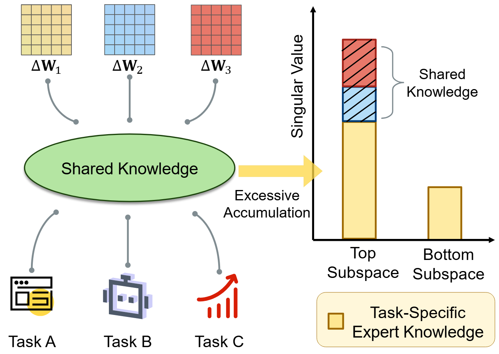

# SVC: Singular Value Calibration for Model Merging

[](https://www.python.org/)
[](https://pytorch.org/)
[](https://arxiv.org/abs/2602.05536)
[](#-license)

English | [中文](#中文版本)

Training-free and data-free singular value calibration for robust model merging across shared subspaces.

## 📰 News

- 💥**2026-05-01**: Our paper is accepted by ICML'26. See you all in Seoul, Korea!
- 💥**2026-03-20**: We appreciate [Anke Tang](https://github.com/tanganke) for including our work in [fusion_bench](https://github.com/tanganke/fusion_bench)!
- 💥**2026-02-05**: We have submitted our paper to arXiv.
---

## 🔗 Quick Links

- [Paper (arXiv:2602.05536)](https://arxiv.org/abs/2602.05536)
- [Quick Start](#-quick-start-5-minutes)
- [Detailed Usage Guide](#-detailed-usage-guide)
- [Project Structure](#-project-structure)
- [Technical Background](#-technical-background)

## 🧭 Contents

- [Project Overview](#-project-overview)
- [News](#-news)
- [Quick Start (5 Minutes)](#-quick-start-5-minutes)
- [Detailed Usage Guide](#-detailed-usage-guide)
- [Project Structure](#-project-structure)
- [Technical Background](#-technical-background)
- [Advanced Usage](#-advanced-usage)
- [Troubleshooting](#-troubleshooting)

## 📋 Project Overview

Model merging combines multiple fine-tuned models into a single model by *adding* their weight updates, providing a lightweight alternative to retraining.
Existing methods primarily target resolving conflicts between task updates, leaving the failure mode of over-counting shared knowledge unaddressed.
We show that when tasks share aligned spectral directions (*i.e.*, overlapping singular vectors), a simple linear combination repeatedly accumulates these directions, inflating the singular values and biasing the merged model toward shared subspaces.
To mitigate this issue, we propose **Singular Value Calibration (SVC)**, a training-free and data-free post-processing method that quantifies subspace overlap and rescales inflated singular values to restore a balanced spectrum.
Across vision and language benchmarks, SVC consistently improves strong merging baselines and achieves state-of-the-art performance.
Furthermore, by modifying only the singular values, SVC improves the performance of Task Arithmetic by 13.0%.

### Highlights

- Training-free and data-free post-processing for model merging.
- Targets spectral over-counting in shared singular directions.
- Plug-and-play with common merging baselines (TA, TIES, STAR, TSV-M, Iso-*).
- Strong empirical gains across vision and language benchmarks.




## 🚀 Quick Start (5 Minutes)

### 1️⃣ Environment Setup

```bash
# Create environment from environment.yml
conda env create -f environment.yml -n SVC
conda activate SVC
```

### 2️⃣ Prepare Checkpoints

Download from [Google Drive](https://drive.google.com/drive/folders/1u_Tva6x0p6oxu5Eo0ZZsf-520Cc_3MKw) and organize:

```
checkpoints/
└── ViT-B-32/
    ├── zeroshot.pt                    # Pre-trained CLIP
    ├── Cars/finetuned.pt
    ├── DTD/finetuned.pt
    └── ... (other tasks)
```

### 3️⃣ Run Your First Experiment

```bash
# Task Arithmetic (baseline)
python main.py --model ViT-B-32 --merge TA

# Task Arithmetic + SVC (calibrated)
python main.py --model ViT-B-32 --merge TA --c

# Try all methods
bash run.sh
```

✅ Results will appear in `logs/ViT-B-32/log_*.txt`

---

## 📖 Detailed Usage Guide

### Command Line Reference

```bash
python main.py [OPTIONS]
```

| Option | Default | Description |
|--------|---------|-------------|
| `--model` | ViT-B-32 | Model architecture (ViT-B-32, ViT-L-14, etc.) |
| `--merge` | TA | Merging method (TA, TSV-M, etc.) |
| `--c` | False | Enable Support Vector Calibration |
| `--alpha` | 0.1 | Calibration weight parameter |
| `--scaling_coef` | 1.0 | Task vector scaling factor |
| `--base_dir` | . | Base directory for checkpoints |

### Available Merging Methods

| Method | Description | Best For | Link |
|--------|-------------|----------|------|
| **TA** | Task Arithmetic (simple average) | Baseline, fast | [link](https://github.com/mlfoundations/task_vectors) |
| **TIES** | Sign-alignment sparse merging | Conflict reduction | [link](https://github.com/prateeky2806/ties-merging) |
| **DARE** | Randomized task vector selection | Regularization | [link](https://github.com/yule-BUAA/MergeLM) |
| **TSV-M** | Task singular vectors merging | Spectral alignment | [link](https://github.com/AntoAndGar/task_singular_vectors) |
| **Iso-C** | Isolated common subspace | Common-space control | [link](https://github.com/danielm1405/iso-merging) |
| **Iso-CTS** | Common + task-specific subspaces | Fine-grained decomposition | [link](https://github.com/danielm1405/iso-merging) |
| **STAR** | Spectral task arithmetic | Non-uniform spectrum | [link](https://github.com/IBM/STAR) |


### Usage Examples

#### Example 1: Reproduce Baseline Results
```bash
python main.py --model ViT-B-32 --merge TA --scaling_coef 0.3
```

#### Example 2: Use SVC for Better Performance
```bash
python main.py --model ViT-B-32 --merge TA --c --alpha 0.5
```

#### Example 3: Compare Multiple Methods
```bash
for method in TA WA TIES STAR; do
  python main.py --model ViT-B-32 --merge $method --c
done
```

#### Example 4: Batch Processing (All Methods)
```bash
bash run.sh
```

---

## 📁 Project Structure

```
SVC/
├── main.py                    # Main entry point
├── merge_func.py              # All merging algorithm implementations
├── run.sh                     # Batch script to run all experiments
├── utils.py                   # Common utilities
│
├── clip/                      # CLIP model implementation
│   ├── clip.py
│   ├── model.py               # ViT architecture
│   └── simple_tokenizer.py    # Tokenization
│
├── src/
│   ├── args.py                # Argument parsing
│   ├── eval.py                # Evaluation on multiple datasets
│   ├── modeling.py            # Model instantiation
│   ├── task_vectors.py        # TaskVector class - core data structure
│   ├── ties_merging_utils.py  # TIES algorithm utilities
│   │
│   └── datasets/              # Dataset implementations
│       ├── registry.py        # Dataset registry & factory
│       ├── common.py          # Base dataset class
│       ├── cifar10.py
│       ├── cifar100.py
│       ├── imagenet.py
│       └── ... (20+ datasets)
│
├── logs/                      # Output logs (auto-created)
│   └── ViT-B-32/
│       └── log_*.txt
│
└── checkpoints/               # Model checkpoints (external)
    └── ViT-B-32/
        ├── zeroshot.pt
        └── */finetuned.pt
```

---

## 🎓 Technical Background

### Core Concepts

**Task Vector**: The difference between fine-tuned and pre-trained weights:
$$\tau_i = \theta_{ft,i} - \theta_{pt}$$

**Merging Task**: Combine n task vectors into a single merged model while preserving knowledge:
$$\theta_{merged} = \theta_{pt} + \text{Merge}(\tau_1, \tau_2, ..., \tau_n)$$

**Support Vector Calibration**: Our proposed method identifies and weights critical parameters for better merging.

### Why Task Vector Merging?

1. ✅ **No Task ID Needed**: Merged model works on all tasks without task-specific routing
2. ✅ **Parameter Efficient**: Single model replaces N fine-tuned models
3. ✅ **Knowledge Preservation**: Combines learned knowledge across tasks
4. ⚠️ **Challenge**: Preventing negative transfer between tasks

---

## 🔧 Advanced Usage

### Custom Merging Method

Add new method to `merge_func.py`:

```python
@torch.no_grad()
def MyMethod(task_vector_avg, task_vectors, config):
    """
    Args:
        task_vector_avg: Initial averaged task vector
        task_vectors: List[TaskVector] of all tasks  
        config: Configuration object with hyperparameters
    
    Returns:
        TaskVector: Merged task vector
    """
    # Your implementation
    print(f"Processing {len(task_vectors)} task vectors...")
    for key in task_vector_avg.vector:
        # Modify task_vector_avg.vector[key]
        pass
    return task_vector_avg
```

Then register in `main.py`:
```python
merge_methods = {
    'TA': TA,
    'MyMethod': MyMethod,
}
```

### Dataset Extension

1. Create new dataset class in `src/datasets/`:
```python
from src.datasets.common import AbstractDataset

class MyDataset(AbstractDataset):
    def __init__(self, root, split='train'):
        # Load your dataset
        pass
```

2. Register in `src/datasets/registry.py`

---

## 📊 Experimental Results

Typical evaluation metrics:
- Accuracy per dataset
- Average accuracy across all tasks
- Runtime and memory consumption

Results logged in: `logs/ViT-B-32/log_YYYYMMDD_HHMMSS_mainV2.txt`

---

## ⚠️ Troubleshooting

### Problem: Checkpoint Loading Fails
```
RuntimeError: Unable to load checkpoint
```
**Solution**: Use pickle instead of torch.load
```python
import pickle
ckpt = pickle.load(open('checkpoint.pt', 'rb'))
state = ckpt.state_dict() if hasattr(ckpt, 'state_dict') else ckpt
```

### Problem: Slow Evaluation
**Solutions**:
- Use GPU: ensure CUDA is available
- Reduce number of evaluation samples
- Use multiprocessing in eval.py

---

## 📚 Related Work & References

- [Task Vectors @ ICLR 2023](https://github.com/mlfoundations/task_vectors) - Foundation of task vector concept
- [TIES-Merging @ ICLR 2024](https://github.com/prateeky2806/ties-merging) - Sign-alignment based merging
- [DARE @ ICML 2024](https://github.com/yule-BUAA/MergeLM) - Data-free parameter merging for large language models
- [TSV-M @ CVPR 2025](https://github.com/AntoAndGar/task_singular_vectors) - Merging via task singular vectors
- [Iso-merging @ ICML 2025](https://github.com/danielm1405/iso-merging) - Separates shared and task-specific subspaces for merging
- [STAR @ NAACL 2025](https://github.com/IBM/STAR) - Spectral task arithmetic with adaptive truncation and rescaling
- [AdaMerging](https://github.com/EnnengYang/AdaMerging) - Adaptive parameter merging

---

## 📝 Citation

If this work helps your research, please cite:

```bibtex
@article{SVC2026,
  title={When Shared Knowledge Hurts: Spectral Over-Accumulation in Model Merging},
  author={Li, Yayuan and Peng, Ze and Zhang, Jian and Guo, Jintao and Duan, Yue and Shi, Yinghuan},
  journal={arXiv preprint arXiv:2602.05536},
  year={2026}
}
``` 

---

## 📄 License

MIT License - See LICENSE file for details

## 🤝 Contributing

Contributions welcome! Please:
1. Fork the repository
2. Create a feature branch
3. Submit a pull request

---

## 中文版本

一句话简介：SVC 是一种无需训练、无需数据的奇异值校准方法，用于提升多任务模型融合的稳定性与泛化性能。

### 🔗 快速导航

- [论文（arXiv:2602.05536）](https://arxiv.org/abs/2602.05536)
- [5 分钟快速开始](#-5-分钟快速开始)
- [使用指南](#-使用指南)

### 项目概述

**SVC** 是一个先进的模型融合框架，该项目基于 [Task Vectors](https://github.com/mlfoundations/task_vectors) 的研究，提出了 **奇异值校准（SVC）** 方法来实现多个微调模型的稳定高效融合。


### 🚀 5 分钟快速开始

```bash
# 1. 环境配置
conda create -n svc python=3.10 -y
conda activate svc
pip install torch torchvision transformers scipy tqdm Pillow

# 2. 下载模型检查点到 checkpoints/ViT-B-32/

# 3. 运行第一个实验
python main.py --model ViT-B-32 --merge TA
python main.py --model ViT-B-32 --merge TA --c  # 使用 SVC
bash run.sh  # 运行所有方法
```

### 📖 使用指南

```bash
python main.py [OPTIONS]
```

主要参数：
- `--model`: 模型架构 (ViT-B-32, ViT-L-14 等)
- `--merge`: 合并方法 (TA, WA, SA, TIES, DARE, STAR, iso_c, iso_cts 等)
- `--c`: 启用支持向量校准
- `--alpha`: 校准权重参数
- `--scaling_coef`: 任务向量缩放系数

### 🎓 核心概念

**任务向量**：微调权重与预训练权重的差：
$$\tau_i = \theta_{ft,i} - \theta_{pt}$$

**合并目标**：将 n 个任务向量合并成单个模型，同时保留所有任务的知识：
$$\theta_{merged} = \theta_{pt} + \text{Merge}(\tau_1, \tau_2, ..., \tau_n)$$

### 🔧 扩展与定制

可以轻松添加新的合并方法、数据集和模型。详见源码注释。

---
